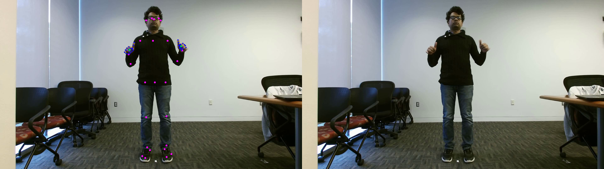

# American Sign Language Recognition using Kinect v2 Sensor
## Method is based on Pose and RGB video input

This repository contains dataset and codes proposed in the following work, <br /> <br />
A. A. Hosain, P. S. Santhalingam, P. Pathak, J. Košecká and H. Rangwala, 
**Sign Language Recognition Analysis using Multimodal Data**, 
2019 IEEE International Conference on Data Science and Advanced Analytics (DSAA), 2019, 
pp. 203-210, doi: 10.1109/DSAA.2019.00035.

## Dataset Download
To access the full dataset, email: ahosain@gmu.edu or see below, <br>
Download the videos and kinect pose, [GMU-ASL51 Download](https://drive.google.com/file/d/1D0Ew6gifUXHZGgXVqKJOt4XlXMTIA7Aj/view?usp=sharing) <br>
Download the openpose poses from, [OpenPose Pose Download](https://drive.google.com/file/d/1vS5pYPhmeEY57ADOeqxmcX9fWqAk09GR/view?usp=sharing) <br>
**See the data-sample directory for detail file structures**

## Sample Data Visualization
The data-sample folder contains sample data from the GMU-ASL51 dataset, proposed in the above work.

To visualize a sample sign video and related pose data, 
1. Download the repository
2. Follow the file structures in the data-sample/Readme
3. Run the visualize script in the form ``` python script_name.py input_video_loc input_pose_loc ```, see below for examples.
4. Run the script draw_pose.py for running with OpenPose based pose, <br />
  ``` python draw_pose.py data-sample/gmu-asl51-samples/subject01/play_subject01_15_rgb.avi data-sample/openpose_pose_samples/subject01_json/ ```
5. Run the script draw_kinect_pose.py for running with kinect pose, <br />
  ``` python draw_kinect_pose.py data-sample/gmu-asl51-samples/subject04/bedroom_subject04_11_rgb.avi data-sample/gmu-asl51-samples/subject04/bedroom_subject04_11_bodyData.txt ```
6. Here is an example visualization using openpose pose,

